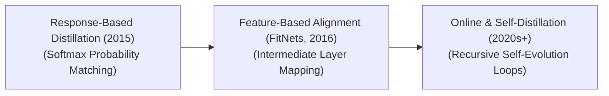

# Awesome-Teacher-Student-Network
## Teacher-Student Networks: Evolution, Variants, Types, & Applications

The Teacher-Student network architecture—fundamentally known as **Knowledge Distillation (KD)**—is a foundational model compression and optimization framework in Artificial Intelligence. Introduced in its modern deep learning form by Geoffrey Hinton et al. in 2015, the paradigm transfers dark knowledge, structural logic, and predictive dark-probability distributions from a massive, high-capacity model (the Teacher) into a compact, resource-efficient model (the Student). By training the student network to mimic the specialized output behaviors or intermediate layer states of the teacher, it preserves the high cognitive accuracy of a frontier foundation system while shrinking parameter sizes, memory footprints, and inference processing latencies.

---

## 1. The Chronological Evolution

The technical implementation of cross-model knowledge transfer has transitioned from terminal label compression to deep geometric layer matching, moving toward modern recursive multi-agent self-distillation ecosystems.

*   **The Response-Based Foundation Era (Hinton et al., 2015)**
    *   *Concept:* The defining milestone. It used a **Temperature-Scaled Softmax** function to extract "dark knowledge" from the teacher's final output layer. Instead of predicting raw binary target classifications, the student model is trained to match the smooth, continuous probability scores (soft targets) generated by the teacher.
    *   *Limitation:* Locked strictly to the terminal output stage. It ignores the rich, abstract spatial concepts learned by the teacher model across its deep internal hidden layers.
*   **The Feature & Relation Mapping Era (~2016–2021)**
    *   *Concept:* Expanded optimization down into the core network graph (pioneered by FitNets). It forces the student's middle hidden layers to directly replicate the activation shapes and mathematical feature maps of the teacher's internal structure. Sub-variants like **Relation-Based Distillation** train the student to match the geometric relationships *between* different data points rather than matching individual targets.
*   **The Online, Generative, & Self-Distillation Era (~2022–Present)**
    *   *Concept:* The modern state-of-the-art framework seen in foundation models and reasoning architectures. It drops the requirement for a pre-trained, static teacher. In **Online Distillation**, multiple student networks train concurrently, updating each other iteratively. In **Self-Distillation**, a single model acts as its own teacher, distilling knowledge from its deep, high-level structural checks back down into its shallow early layers to maximize execution efficiency.

---

## 2. Core Functional & Knowledge-Type Variants

Teacher-student optimization workflows are strictly categorized based on what specific mathematical parameters are being targeted for architectural extraction across the network graphs.

*   **Response-Based Knowledge Distillation**
    *   *Target:* Terminal logits and outputs.
    *   *Mechanism:* Directly measures the Kullback-Leibler (KL) divergence between the soft probability distributions of the teacher and student, guiding the student to adopt the teacher's fine-grained multi-class uncertainty.
*   **Feature-Based Knowledge Distillation**
    *   *Target:* Intermediate hidden layers.
    *   *Mechanism:* Uses projection matrices (linear alignment layers) to reconcile tensor dimension discrepancies between models, forcing the student to map physical concepts (e.g., textures, edges, or syntax boundaries) exactly like the teacher framework.
*   **Relation-Based Knowledge Distillation**
    *   *Target:* Graph manifold structures.
    *   *Mechanism:* Computes a similarity matrix across an entire batch of data points, ensuring that the student network internalizes how the teacher structures the overall geometric distance and concept clustering of the data space.

---

## 3. Structural Execution & Training Paradigms

Depending on the availability of training resources and pre-existing networks, teacher-student communication follows three distinct structural scheduling pipelines.

*   **Offline Distillation (The Classic Approach)**
    *   *Pipeline:* A massive, highly complex teacher model is trained to full convergence first. Its weights are completely frozen, and it serves as a static dataset labeling machine, generating soft target logs to train a custom student network from scratch.
*   **Online Distillation (Co-Distillation)**
    *   *Pipeline:* Eliminates static teachers. Both the teacher and student architectures (or an ensemble of multiple peer networks) start from random initializations and train simultaneously, actively sharing their logit probability maps at each optimization step.
*   **Self-Distillation (Recursive Compression)**
    *   *Pipeline:* A single deep model splits its own computational graph. The deep, terminal layers act as the teacher, using their contextual overview to supervise and refine the feature extraction capabilities of the early, shallow layers within the exact same model.

---

## 4. Production Engineering Challenges & Mitigations

Deploying a compressed teacher-student system inside commercial pipelines requires balancing capacity limits and domain gaps to protect accuracy levels.

*   **The Capacity Gap Paradox**
    *   *The Phenomenon:* Counterintuitively, if a teacher model is *too large* compared to the student (e.g., distilling a 70B parameter model directly into a 1B parameter network), performance can collapse. The student lacks the raw parameter capacity to capture the teacher's complex, non-linear reasoning, causing structural divergence.
    *   *Mitigation:* Implementing **Multi-Stage Teacher Assistant Distillation**. The knowledge is transferred incrementally down a chain of medium-sized intermediate models (e.g., 70B $\rightarrow$ 14B $\rightarrow$ 7B $\rightarrow$ 1B), smoothly downscaling the semantic abstractions.
*   **The Softmax Saturation Bottleneck**
    *   *The Phenomenon:* If the teacher's final output scores are extremely crisp (e.g., assigning a 0.999 probability to the correct class), the remaining classes collapse to zero. The soft targets become hard labels, erasing the valuable dark knowledge needed to guide the student.
    *   *Mitigation:* Deploying **Temperature Scaling ($T$)** to divide unnormalized logits before the Softmax function, smoothing out the probability curves to expose hidden class associations.

---

## 5. Frontier Real-World AI Applications

*   **Edge & Local Reasoning Model Deployment (Model Distillation)**
    *   *Application:* Compresses massive cloud models into lightweight, open-weights configurations (e.g., distilling DeepSeek-R1 down to compact 8B and 1.5B parameters). The compact student models inherit structural System 2 reasoning chains, formatting styles, and mathematical verification frameworks, permitting edge devices to run deep logic queries locally.
*   **Autonomous Mobile Perception Compressors (TinyML)**
    *   *Application:* Compresses multi-gigabyte autonomous driving or drone vision transformers down to mobile-friendly micro-networks. The compact student handles real-time object classification and frame-rate localization maps inside low-power microcontrollers without draining hardware batteries.
*   **Real-Time Natural Language Translation Pipelines**
    *   *Application:* Commercial text serving systems (like customer support virtual assistants). High-latency ensemble transformer stacks distill their semantic language profiles down into tiny, specialized student models, drastically compressing **Time-to-First-Token (TTFT)** metrics for high-volume concurrent streams.

