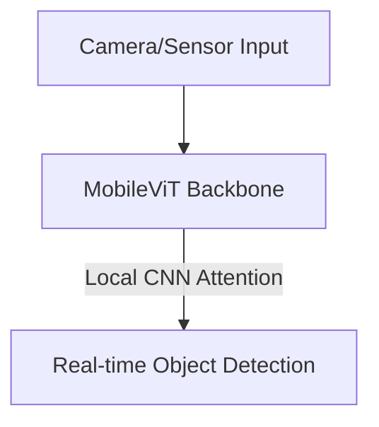

# Autonomous Mobile Perception Compressors (TinyML)

## Concept Diagram

## Detailed Explanation
Autonomous Mobile Perception Compressors leverage TinyML optimization to run vision models on low-power hardware.

### Core Concept
Autonomous systems (like drones and vehicles) require real-time processing under strict battery constraints. Distilling massive cloud-based vision transformers down to mobile-friendly architectures like MobileViT enables sub-millisecond local inference for classification and object detection.

### Seminal Paper
- **MobileViT: Light-weight, General-purpose, and Mobile-friendly Vision Transformer (2021):** [arXiv:2110.02199](https://arxiv.org/abs/2110.02199)

---
[← Back to README](../README.md)
