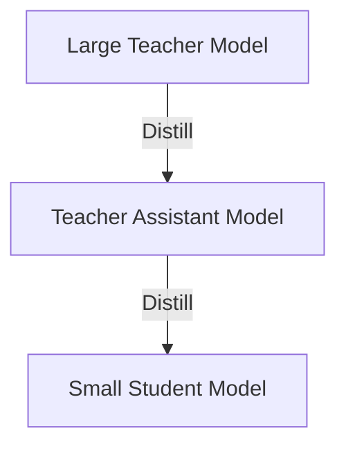

# The Capacity Gap Paradox

## Concept Diagram

## Detailed Explanation
The Capacity Gap Paradox describes a phenomenon where a larger, more accurate teacher model performs worse at instructing a small student model compared to a smaller teacher model.

### Core Concept
If the capacity gap between the teacher and the student is too large (e.g., 70B parameter model instructing a 1B parameter model), the student lacks the representational power to capture the teacher's complex manifolds. 

### Mitigation: Teacher Assistant KD (TAKD)
To solve this, a Teacher Assistant (TA) model of intermediate size is introduced. The teacher distills knowledge to the TA, and the TA distills knowledge to the student, ensuring a smooth transition of knowledge.

### Seminal Paper
- **Improved Knowledge Distillation via Teacher Assistant (2019/2020):** [arXiv:1902.03393](https://arxiv.org/abs/1902.03393)

---
[← Back to README](../README.md)
