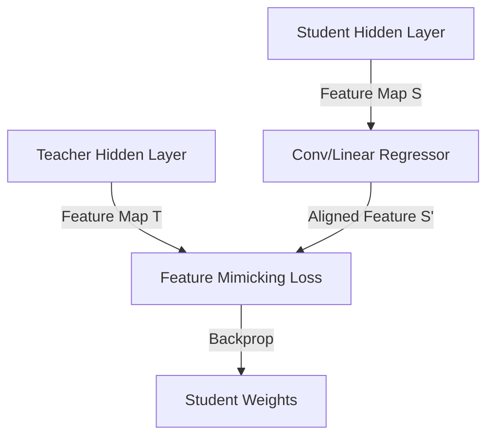

# Feature-Based Knowledge Distillation

## Concept Diagram

## Detailed Explanation
Feature-Based Knowledge Distillation targets intermediate representations rather than terminal output logits.

### Core Concept
Intermediate hidden layers contain rich abstract features (such as edges, shapes, textures, or syntax boundaries). Feature-based distillation forces the student's hidden states to match the corresponding hidden states of the teacher. A regressor is often applied to match the channel dimensions of the student to the teacher.

### Seminal Paper
- **FitNets: Hints for Thin Deep Nets (2014/2015):** [arXiv:1412.6550](https://arxiv.org/abs/1412.6550)

---
[← Back to README](../README.md)
