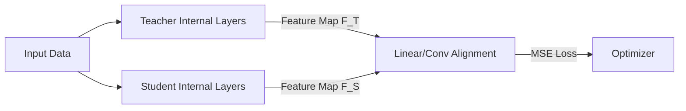

# The Feature & Relation Mapping Era

## Concept Diagram

## Detailed Explanation
The Feature & Relation Mapping Era (~2016–2021) marked a shift from matching terminal output logits to aligning the intermediate representation spaces of the teacher and student networks.

### Core Concept
Pioneered by frameworks like FitNets (2014/2015), this era introduced using intermediate hidden layer features ("hints") to guide the training of the student. Because the student's hidden layers often have different dimensions than the teacher's, projection matrices (linear or convolutional alignment layers) are utilized to map the student features into the teacher's feature space.

### Seminal Papers
- **FitNets: Hints for Thin Deep Nets (2014/2015):** [arXiv:1412.6550](https://arxiv.org/abs/1412.6550)
- **Relational Knowledge Distillation (2019):** [arXiv:1904.05068](https://arxiv.org/abs/1904.05068)

---
[← Back to README](../README.md)
