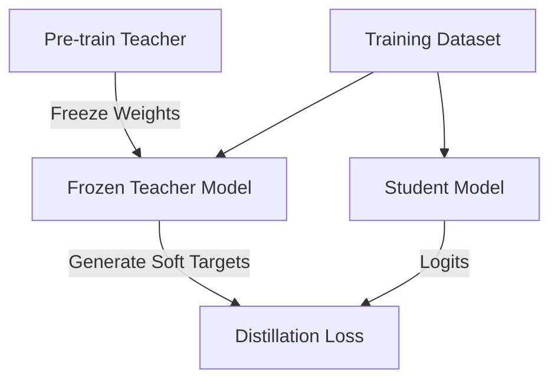

# Offline Distillation

## Concept Diagram

## Detailed Explanation
Offline Distillation is the classic and most common training scheduling pipeline for knowledge distillation.

### Core Concept
1. **Teacher Pre-training:** A high-capacity teacher network is trained to convergence on a specific dataset.
2. **Knowledge Transfer:** The teacher's parameters are frozen. The student network is trained using the frozen teacher's predictions as soft labels.
3. **Efficiency:** The soft labels can be pre-computed to save training resources, making it highly robust.

### Seminal Paper
- **Distilling the Knowledge in a Neural Network (2015):** [arXiv:1503.02531](https://arxiv.org/abs/1503.02531)

---
[← Back to README](../README.md)
