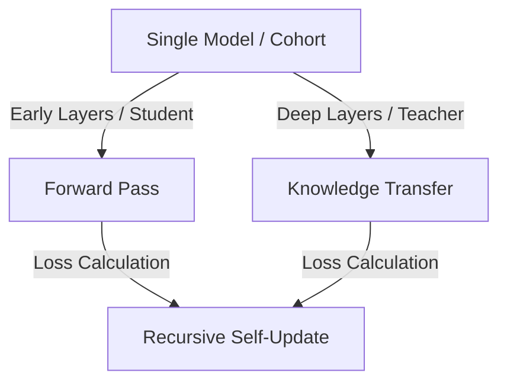

# The Online, Generative, & Self-Distillation Era

## Concept Diagram

## Detailed Explanation
The Online, Generative, and Self-Distillation Era (~2022–Present) represents the modern phase of knowledge transfer, removing the requirement for a pre-trained, static teacher model.

### Core Concept
In this modern era:
- **Online Distillation:** A cohort of peer networks are trained simultaneously, teaching one another.
- **Self-Distillation:** A single neural network uses its own deep layers to supervise its early/shallow layers, optimizing inference efficiency recursively.
- **Generative Distillation:** Utilizes generative networks to synthesize training samples or distill structural logic iteratively.

### Seminal Papers
- **Deep Mutual Learning (2017/2018):** [arXiv:1706.00384](https://arxiv.org/abs/1706.00384)
- **Be Your Own Teacher: Improve the Performance of CNNs via Self-Distillation (2019):** [arXiv:1905.08094](https://arxiv.org/abs/1905.08094)

---
[← Back to README](../README.md)
