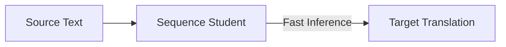

# Real-Time Natural Language Translation Pipelines

## Concept Diagram

## Detailed Explanation
Real-Time Natural Language Translation Pipelines utilize sequence-level distillation to bypass slow search processes like beam search.

### Core Concept
Machine translation models are typically autoregressive and require beam search decoding, which is slow. By distilling sequence-level output distributions from a teacher ensemble, student models can achieve comparable translation accuracy using simple greedy decoding, delivering massive speedups.

### Seminal Paper
- **Sequence-Level Knowledge Distillation (2016):** [arXiv:1606.07947](https://arxiv.org/abs/1606.07947)

---
[← Back to README](../README.md)
