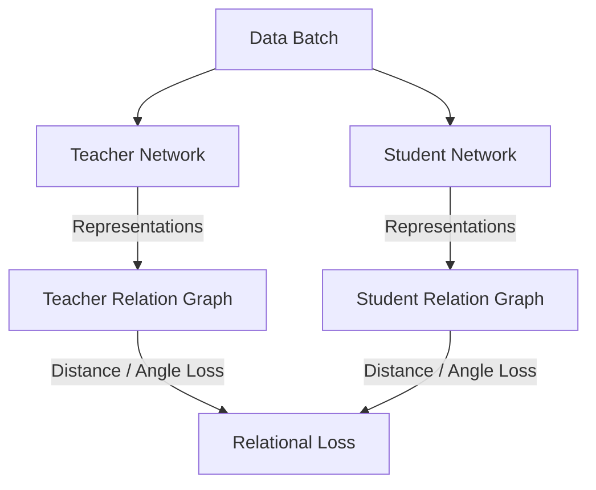

# Relation-Based Knowledge Distillation

## Concept Diagram

## Detailed Explanation
Relation-Based Knowledge Distillation focuses on transferring structural knowledge mapped between data points rather than isolated data representations.

### Core Concept
Instead of matching individual outputs or intermediate layers, relation-based KD optimizes the geometric manifold of the data. It computes relationships (like cosine similarity, Euclidean distance, or angular ratios) between different samples in a batch. The student is then optimized to replicate this relational structure.

### Seminal Paper
- **Relational Knowledge Distillation (2019):** [arXiv:1904.05068](https://arxiv.org/abs/1904.05068)

---
[← Back to README](../README.md)
