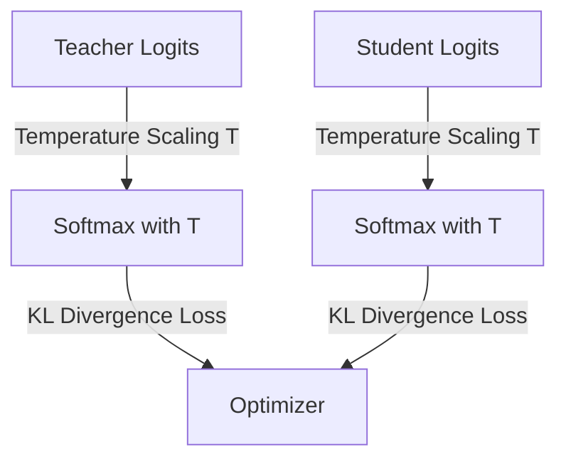

# The Response-Based Foundation Era

## Concept Diagram

## Detailed Explanation
The Response-Based Foundation Era (typically starting around Hinton et al., 2015) represents the birth of modern deep learning knowledge distillation. 

### Core Concept
In this paradigm, the student model learns directly from the output predictions of the teacher model. Specifically, it targets the final output logit layers, using a temperature-scaled softmax function to match the teacher's probability distribution.

### Mathematical Formulation
The softened probability $p_i$ of class $i$ is calculated as:
$$q_i = \frac{\exp(z_i / T)}{\sum_j \exp(z_j / T)}$$
where $z$ represents the raw output logits and $T$ is the temperature parameter. A higher temperature produces a softer probability distribution, revealing "dark knowledge" (the relative similarity structures of incorrect classes).

### Seminal Paper
- **Title:** Distilling the Knowledge in a Neural Network (2015)
- **Authors:** Geoffrey Hinton, Oriol Vinyals, Jeff Dean
- **Paper Link:** [arXiv:1503.02531](https://arxiv.org/abs/1503.02531)

---
[← Back to README](../README.md)
