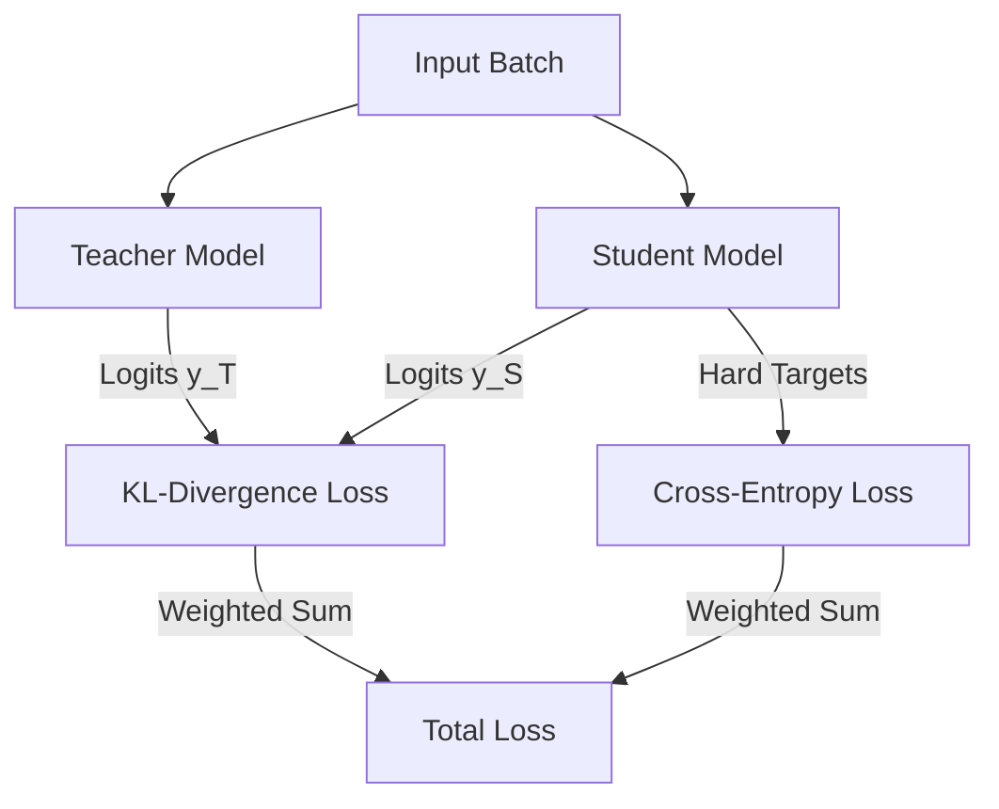

# Response-Based Knowledge Distillation

## Concept Diagram

## Detailed Explanation
Response-Based Knowledge Distillation is the most straightforward and widely used distillation format.

### Core Concept
The student model learns to mimic the final predictions (logits) of the teacher. The training objective combines standard supervised learning loss (e.g., cross-entropy with ground-truth labels) and the distillation loss (Kullback-Leibler divergence between temperature-scaled softmax outputs of the student and teacher).

### Seminal Paper
- **Distilling the Knowledge in a Neural Network (2015):** [arXiv:1503.02531](https://arxiv.org/abs/1503.02531)

---
[← Back to README](../README.md)
