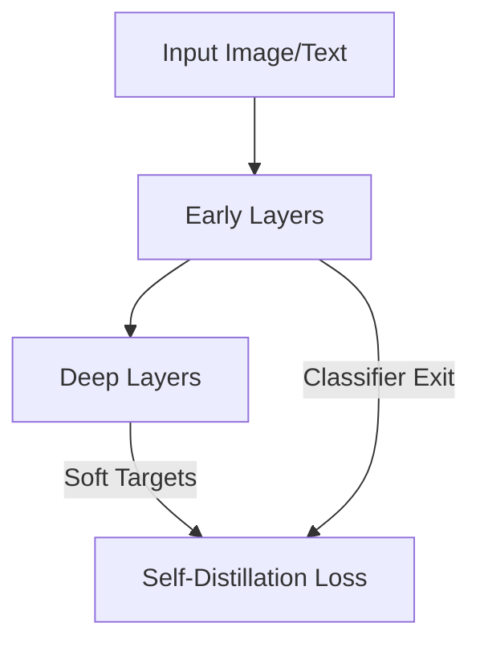

# Self-Distillation (Recursive Compression)

## Concept Diagram

## Detailed Explanation
Self-Distillation is a technique where a single neural network acts as its own teacher, distilling knowledge from deep layers to shallow layers.

### Core Concept
Auxiliary classifiers are appended to intermediate layers of a deep network. During training, the final layers generate target distributions that guide the optimization of early layers. This regularizes the network and enables dynamic early exiting during inference, drastically improving latency.

### Seminal Paper
- **Be Your Own Teacher: Improve the Performance of CNNs via Self-Distillation (2019):** [arXiv:1905.08094](https://arxiv.org/abs/1905.08094)

---
[← Back to README](../README.md)
